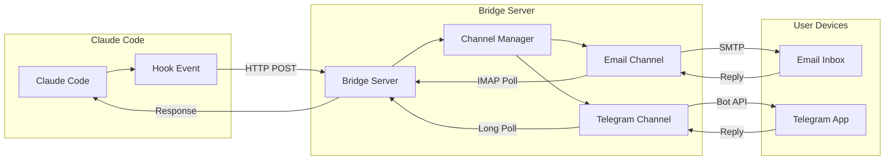
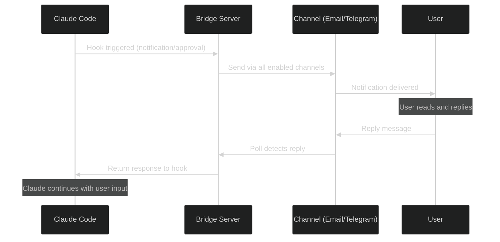

# Claude Code Anywhere

[](https://github.com/blueraai/claude-code-anywhere/actions/workflows/ci.yml)
[](https://github.com/blueraai/claude-code-anywhere)


> **Stay connected to your Claude Code sessions from anywhere.** Get notifications via Email or Telegram when tasks complete, approve operations remotely, and respond to prompts from any device.

---

## Why Claude Code Anywhere?

When Claude Code needs your input—a question, approval, or notification—you shouldn't have to be tethered to your terminal.

| Scenario | Without | With Claude Code Anywhere |
|----------|---------|---------------------------|
| Task completes | Sit and wait, or miss it | Get notified instantly |
| Claude asks a question | Session blocks until you notice | Reply from your phone |
| Destructive operation | Must be at terminal to approve | Approve via email: "Y" |
| Long-running task | Keep checking back | Do other things, get pinged |

**The result:** Run background tasks with confidence. Walk away. Stay connected.

---

## Table of Contents

<details>
<summary>Click to expand</summary>

- [Why Claude Code Anywhere?](#why-claude-code-anywhere)
- [Features](#features)
- [Architecture](#architecture)
- [Quick Start](#quick-start)
- [Channel Setup](#channel-setup)
  - [Email Channel](#email-channel)
  - [Telegram Channel](#telegram-channel)
- [Commands](#commands)
- [Configuration](#configuration)
- [Hook Events](#hook-events)
- [Security](#security)
- [Troubleshooting](#troubleshooting)
- [Comparison with Claude Code Remote](#comparison-with-claude-code-remote)
- [Development](#development)
  - [Setup](#setup)
  - [Scripts](#scripts)
  - [Project Structure](#project-structure)
  - [Dogfooding](#dogfooding)
  - [Releasing](#releasing)
- [Contributing](#contributing)
- [License](#license)
- [Support](#support)

</details>

---

## Features

| Feature | Description |
|---------|-------------|
| **Multi-Channel** | Email, Telegram, or both simultaneously |
| **Bidirectional** | Send notifications AND receive replies |
| **Multi-Session** | Track multiple Claude Code sessions independently |
| **Easy Toggle** | `/notify on` and `/notify off` |
| **Provider Flexible** | Any SMTP/IMAP email provider |
| **85% Test Coverage** | Production-ready with comprehensive tests |

---

## Architecture



### Message Flow



---

## Quick Start

### 1. Install the Plugin

```bash
claude /plugin add github.com/blueraai/claude-code-anywhere
```

### 2. Configure at Least One Channel

Copy `.env.example` to `.env` and configure your channel settings:

**Email:**
```env
EMAIL_USER=claude-notify@gmail.com    # Dedicated sending account
EMAIL_PASS=xxxx-xxxx-xxxx-xxxx        # App password (not your main password!)
EMAIL_RECIPIENT=you@example.com       # Where YOU receive notifications
```

**Telegram:**
```env
TELEGRAM_BOT_TOKEN=123456789:ABCdef...  # From @BotFather
TELEGRAM_CHAT_ID=123456789              # Your chat ID
```

You can configure one or both channels.

### 3. Enable Notifications

```bash
/notify on    # Starts server and enables hooks
```

### 4. Test It

```bash
/notify-test  # Sends test message to all configured channels
```

---

## Channel Setup

### Email Channel

<details>
<summary><b>Gmail Setup</b></summary>

**Step 1: Create a Dedicated Account**

Create a new Gmail account for Claude (e.g., `my-claude-notify@gmail.com`). Using a dedicated account keeps your personal inbox clean and is more secure.

**Step 2: Enable 2-Factor Authentication**

1. Go to [Google Account Security](https://myaccount.google.com/security)
2. Enable 2-Step Verification

**Step 3: Create App Password**

1. Go to [Google App Passwords](https://myaccount.google.com/apppasswords)
2. Select "Mail" and your device
3. Copy the 16-character password (no spaces)

**Step 4: Add to `.env`**

```env
EMAIL_USER=my-claude-notify@gmail.com
EMAIL_PASS=abcdefghijklmnop  # The app password (no spaces)
EMAIL_RECIPIENT=your-real-email@example.com
```

</details>

<details>
<summary><b>Other Email Providers</b></summary>

**Outlook/Office 365:**
```env
SMTP_HOST=smtp.office365.com
SMTP_PORT=587
IMAP_HOST=outlook.office365.com
IMAP_PORT=993
```

**Yahoo:**
```env
SMTP_HOST=smtp.mail.yahoo.com
SMTP_PORT=465
IMAP_HOST=imap.mail.yahoo.com
IMAP_PORT=993
```

**Custom SMTP/IMAP:**
```env
SMTP_HOST=mail.example.com
SMTP_PORT=587
IMAP_HOST=mail.example.com
IMAP_PORT=993
```

</details>

### Telegram Channel

<details>
<summary><b>Telegram Setup Guide</b></summary>

**Step 1: Create a Bot**

1. Open Telegram and search for [@BotFather](https://t.me/BotFather)
2. Send `/newbot` and follow the prompts:
   - Choose a display name (e.g., "Claude Code Notify")
   - Choose a username ending in `bot` (e.g., `my_claude_notify_bot`)
3. BotFather will reply with your bot token:
   ```
   Use this token to access the HTTP API:
   123456789:ABCdefGHIjklMNOpqrsTUVwxyz
   ```
4. Copy the entire token (including the colon)

**Step 2: Get Your Chat ID**

1. Search for [@userinfobot](https://t.me/userinfobot) and start a chat
2. It will immediately reply with your user info:
   ```
   Id: 123456789
   ```
3. Copy the numeric ID

**Step 3: Start Your Bot**

1. Search for your new bot by its username
2. Click "Start" or send `/start` — **required before the bot can message you**

**Step 4: Add to `.env`**

```env
TELEGRAM_BOT_TOKEN=123456789:ABCdefGHIjklMNOpqrsTUVwxyz
TELEGRAM_CHAT_ID=123456789
```

**Replying to Notifications**

Simply send a message in the chat — it will automatically be linked to the most recent notification. You can also use Telegram's reply feature for explicit threading.

</details>

---

## Commands

### `/notify status`

Show current server and channel status.

<details open>
<summary><b>Example output</b></summary>

**Notification Status**

| | Status |
|---|---|
| Server | ✅ Running |
| Uptime | ~8 minutes |
| Active sessions | 1 |
| Pending responses | 0 |

**Channels**

| Channel | Config | Enabled | Connected | Last Activity | Error |
|---------|--------|---------|-----------|---------------|-------|
| Email | `claudecode@gmail.com` → `you@example.com` | ✅ | ✅ | - | - |
| Telegram | Chat ID: `123456789` | ✅ | ✅ | - | - |

</details>

---

### `/notify on`

Start the bridge server and enable notifications.

<details>
<summary><b>Example output</b></summary>

Notifications enabled.

**Notification Status**

| | Status |
|---|---|
| Server | ✅ Running |
| Uptime | just started |
| Active sessions | 1 |
| Pending responses | 0 |

**Channels**

| Channel | Config | Enabled | Connected | Last Activity | Error |
|---------|--------|---------|-----------|---------------|-------|
| Email | `claudecode@gmail.com` → `you@example.com` | ✅ | ✅ | - | - |
| Telegram | Chat ID: `123456789` | ✅ | ✅ | - | - |

</details>

---

### `/notify off`

Stop the bridge server and disable notifications.

<details>
<summary><b>Example output</b></summary>

Notifications disabled. Server stopped.

</details>

---

### `/notify-test`

Send a test message to all configured channels.

<details>
<summary><b>Example output</b></summary>

Test notification sent!

Sent to 2 channels:
- ✅ Email
- ✅ Telegram

Check your inbox/Telegram for the test message.

</details>

---

### `/notify-statusline`

Add or remove the notify status indicator from your Claude Code statusline.

```
/notify-statusline on   # Add indicator to statusline
/notify-statusline off  # Remove indicator from statusline
```

<details>
<summary><b>Example output</b></summary>

Notify indicator added to statusline.

Your statusline will now show:
- **NOTIFY** (green) when notify server is running
- **notify** (dim gray) when notify server is off

Restart Claude Code or wait for statusline refresh to see the change.

</details>

---

## Configuration

### Environment Variables

| Variable | Required | Default | Description |
|----------|----------|---------|-------------|
| **Email** | | | |
| `EMAIL_USER` | Yes* | - | Sending account (Claude's email) |
| `EMAIL_PASS` | Yes* | - | App password |
| `EMAIL_RECIPIENT` | Yes* | - | Your email for notifications |
| `SMTP_HOST` | No | smtp.gmail.com | SMTP server |
| `SMTP_PORT` | No | 587 | SMTP port |
| `IMAP_HOST` | No | imap.gmail.com | IMAP server |
| `IMAP_PORT` | No | 993 | IMAP port |
| `EMAIL_POLL_INTERVAL_MS` | No | 5000 | Reply check interval |
| **Telegram** | | | |
| `TELEGRAM_BOT_TOKEN` | No | - | Bot token from @BotFather |
| `TELEGRAM_CHAT_ID` | No | - | Your chat ID |
| **Server** | | | |
| `BRIDGE_PORT` | No | 3847 | Bridge server port |
| `BRIDGE_URL` | No | http://localhost:3847 | Bridge URL |

*Required if using email channel (at least one channel must be configured)

### State File

Settings persist in `~/.claude/claude-code-anywhere/state.json`:

```json
{
  "enabled": true,
  "hooks": {
    "Notification": true,
    "Stop": true,
    "PreToolUse": true,
    "UserPromptSubmit": false
  }
}
```

---

## Hook Events

| Event | When It Fires | Notification |
|-------|---------------|--------------|
| `Notification` | Status updates, info messages | Sent immediately |
| `Stop` | Session/task ends | Sent immediately |
| `PreToolUse` | Before Bash/Write/Edit | **Waits for your approval** |
| `UserPromptSubmit` | Claude needs input | **Waits for your response** |

---

## Security

| Measure | Description |
|---------|-------------|
| **App Passwords** | Never use your main email password |
| **Dedicated Account** | Use a separate email for Claude |
| **Sender Verification** | Only processes replies from `EMAIL_RECIPIENT` |
| **Session Isolation** | Session IDs prevent cross-session interference |
| **Auto-Expiry** | Sessions timeout after 30 minutes |
| **No Secrets** | Never sends credentials via notification |

---

## Troubleshooting

<details>
<summary><b>Email Not Sending</b></summary>

1. Verify environment variables:
   ```bash
   echo $EMAIL_USER $EMAIL_RECIPIENT
   ```
2. Ensure you're using an **app password**, not your main password
3. For Gmail, verify 2FA is enabled
4. Check logs: `tail -f logs/*.log`

</details>

<details>
<summary><b>Telegram Not Working</b></summary>

1. Did you click "Start" on your bot? (Required!)
2. Verify bot token and chat ID are correct
3. Check logs for API errors
4. Try `/notify-test` to diagnose

</details>

<details>
<summary><b>Response Not Received</b></summary>

1. For email: Reply from the correct address (`EMAIL_RECIPIENT`)
2. For Telegram: Send a message in the bot chat (or use explicit reply)
3. Check server logs for polling errors
4. Ensure session hasn't expired (30 min timeout)

</details>

<details>
<summary><b>Server Won't Start</b></summary>

1. Check if port is in use: `lsof -i :3847`
2. Try different port: Set `BRIDGE_PORT=3848` in environment, then `/notify on`
3. Verify at least one channel is configured

</details>

---

## Comparison with Claude Code Remote

[Claude Code Remote](https://github.com/JessyTsui/Claude-Code-Remote) is a feature-rich notification system that inspired some of our design. Here's how they compare:

| Feature | Claude Code Anywhere | Claude Code Remote |
|---------|---------------------|-------------------|
| **Channels** | Email, Telegram | Email, Telegram, LINE, Desktop |
| **Integration** | Native hooks + HTTP | PTY relay + scripts |
| **Setup** | `.env` file | Interactive wizard |
| **Codebase** | TypeScript, 89% tested | JavaScript |
| **Telegram mode** | Polling (simpler) | Webhook |
| **Public URL needed** | No | Yes (for webhooks) |
| **Group support** | 1:1 only | Groups supported |
| **Focus** | Clean, minimal, reliable | Feature-rich, flexible |

Both projects solve the same problem. We use Claude Code's native hook system; Claude Code Remote uses terminal injection for more direct control.

**When to use Claude Code Anywhere:**
- You want simple `.env` configuration
- Email and/or Telegram are sufficient
- You don't want to set up a public URL for webhooks
- You prefer a typed, tested codebase
- Plugin-based installation is preferred

**When to use Claude Code Remote:**
- You need LINE or desktop notifications
- You need group/team notifications
- You have a public URL for webhooks
- You want direct terminal control
- You prefer interactive setup wizards

---

## Development

### Setup

```bash
git clone https://github.com/blueraai/claude-code-anywhere.git
cd claude-code-anywhere
bun install
bun run build
```

### Scripts

| Command | Description | When to Use |
|---------|-------------|-------------|
| `bun run build` | Compile TypeScript to dist/ | After code changes |
| `bun run dev` | Watch mode compilation | During active development |
| `bun run test` | Run tests in watch mode | During TDD/development |
| `bun run test:run` | Run tests once | Quick verification |
| `bun run test:coverage` | Run tests with coverage | Before committing |
| `bun run lint` | Run ESLint | Check code style |
| `bun run typecheck` | TypeScript type checking | Verify type safety |
| `bun run precommit` | Full validation (lint, types, tests, build) | Runs automatically on commit |
| `bun run version:patch` | Bump patch version (0.0.x) | Bug fixes |
| `bun run version:minor` | Bump minor version (0.x.0) | New features |
| `bun run version:major` | Bump major version (x.0.0) | Breaking changes |
| `bun run release:patch` | Version bump + tag + push | Release bug fixes |
| `bun run release:minor` | Version bump + tag + push | Release new features |
| `bun run release:major` | Version bump + tag + push | Release breaking changes |

### Project Structure

```
claude-code-anywhere/
├── plugin.json               # Plugin manifest
├── commands/
│   ├── notify.md             # /notify command
│   ├── notify-test.md        # /notify-test command
│   └── notify-statusline.md  # /notify-statusline command
├── hooks/
│   ├── hooks.json            # Hook definitions
│   └── scripts/              # Hook scripts
├── src/
│   ├── server/
│   │   ├── index.ts          # Server entry
│   │   ├── channels.ts       # Channel manager
│   │   ├── email.ts          # Email channel
│   │   ├── telegram.ts       # Telegram channel
│   │   ├── routes.ts         # HTTP routes
│   │   └── sessions.ts       # Session management
│   ├── shared/
│   │   ├── channel.ts        # Channel interface
│   │   ├── config.ts         # Configuration
│   │   └── types.ts          # Type definitions
│   └── cli.ts                # CLI entry
├── tests/                    # Test files (85% coverage)
└── dist/                     # Compiled output
```

### Dogfooding

Develop this plugin while using it with Claude Code:

```bash
claude --plugin-dir .  # assumes running from repo root
```

Changes take effect on Claude Code restart (no reinstall needed).

**Safety:** Hook scripts check if the bridge server is running first (1 second timeout). If not running, they exit silently and don't block your workflow.

| Mode | Server | Behavior |
|------|--------|----------|
| **Develop** | Off | Hooks do nothing, develop normally |
| **Test** | Running + `/notify on` | Full notification flow |
| **Pause** | Running + `/notify off` | Hooks check and exit early |

### Known Limitation: Plugin Root Path

`${CLAUDE_PLUGIN_ROOT}` is NOT available in most command contexts. This is a known Claude Code limitation ([#9354](https://github.com/anthropics/claude-code/issues/9354), [#12541](https://github.com/anthropics/claude-code/issues/12541)).

| Context | `CLAUDE_PLUGIN_ROOT` Available |
|---------|-------------------------------|
| Hook scripts (directly invoked) | Yes |
| Dynamic context (`!` backtick) | **No** (tested) |
| Plugin frontmatter (`allowed-tools`) | Yes (v2.1.0+) |
| Bash commands from skill instructions | **No** |

**Workaround**: Bootstrap resolver script ([community solution](https://github.com/anthropics/claude-code/issues/9354)).

On first use in a project, Claude will run the bootstrap skill to create `.claude/cpr.sh`:
```bash
# The resolver script finds the plugin via:
# 1. CLAUDE_PLUGIN_ROOT (if available)
# 2. ~/.claude/plugins/installed_plugins.json lookup
# 3. Python fallback

# Commands then use:
PLUGIN_ROOT=$(.claude/cpr.sh)
cd "$PLUGIN_ROOT" && bun run server
```

### Releasing

```bash
# One command does everything: bump, commit, tag, push
bun run release:patch   # Bug fixes (0.0.x)
bun run release:minor   # New features (0.x.0)
bun run release:major   # Breaking changes (x.0.0)
```

**What happens automatically:**
1. Version bumped in package.json, plugin.json
2. CHANGELOG.md generated from commits
3. Git tag created and pushed
4. GitHub Actions creates release
5. Marketplace updated with new version

**Note:** The `dist/` directory must be committed (plugins have no build step during installation).

---

## Contributing

Contributions welcome! Please:

1. Fork the repository
2. Create a feature branch
3. Add tests (maintain 80%+ coverage)
4. Submit a pull request

---

## License

MIT — See [LICENSE](./LICENSE) for details.

---

## Support

- **Issues**: [GitHub Issues](https://github.com/blueraai/claude-code-anywhere/issues)
- **Changelog**: [CHANGELOG.md](./CHANGELOG.md)
